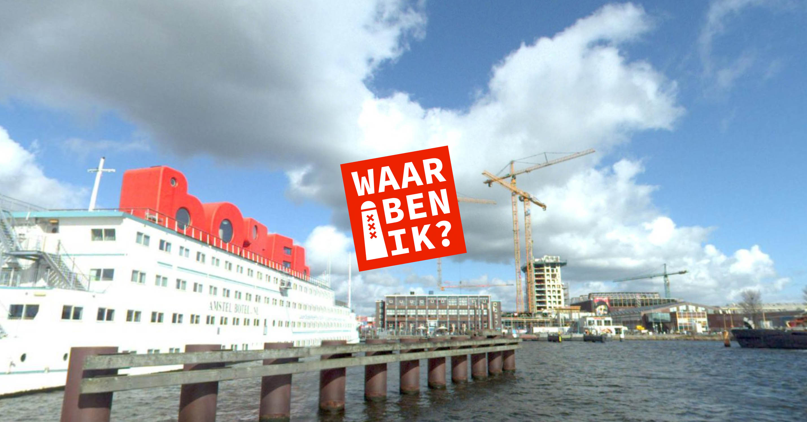

# Waar ben ik?

__Je wordt gedropt op een willekeurige plek in Amsterdam. Kun je raden waar je bent? Hoe dichterbij, hoe hoger je score.__

Geïnspireerd door <a href="https://geoguessr.com/world/play">GeoGuessr</a>, maar dan voor
Amsterdam en gemaakt met open source-tools en Amsterdamse open data.
Lees meer over deze data op het <a href="https://amsterdam.github.io/datablog/2019/03/21/360-gradenfotos-van-de-hele-stad/">Datablog van
data.amsterdam.nl</a>.

Gemaakt door <a href="https://bertspaan.nl/">Bert Spaan</a>, ontworpen door <a href="http://luukvandeven.nl/">Luuk van de Ven</a>.

Speel __Waar ben ik?__ op [bertspaan.nl/waar-ben-ik](https://bertspaan.nl/waar-ben-ik)!

Alle geschatte locaties worden opgeslagen in een SQLite-database, [via Glitch](https://glitch.com/edit/#!/waar-ben-ik). Al deze locaties zijn te bekijken in een [Observable-notebook](https://observablehq.com/@bertspaan/waar-ben-ik-submissions-visualization).
